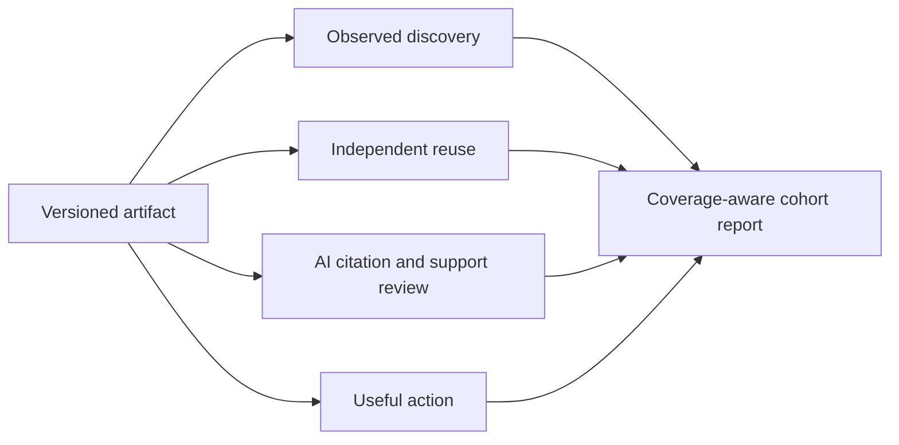

# Earn the evidence of a mature resource

Edition 1.0.0 · reviewed 8 September 2026 · corpus 1.4.0.

A young resource can offer mature functionality immediately: a reproducible example, an honest comparison, a correction process or a usable data release. It cannot acquire a real history or independent reputation by declaring them. Our proposed technique is **functional emulation**: identify what an established resource enables, then implement that function with evidence appropriate to the actual project.

This edition adds ten implementation patterns, a fit-based distribution register, a four-work DOI reading corpus and **Evidence Relay**, a project-designed analytical workflow. The workflow combines existing provenance, cohort and citation-evaluation ideas. It is not claimed to be a new scientific discovery or a proven ranking mechanism.

[Pattern library](./discoverability.html) · [Distribution register](./knowledge/research/distribution-venues.json) · [DOI reading corpus](./knowledge/research/doi-reading-corpus.json) · [Existing maturity profile](./MATURITY-PROFILE.md)

## Functional emulation: copy the useful capability

Use the existing [Search Maturity workflow](./SEARCH-MATURITY-BENCHMARK.md) to select several independent reference pages for one actual audience intent. Record the query, surface, date, locale and observable evidence. Include weaker examples and counterexamples. A source appearing in our research results does not establish a Google rank or explain why it ranks.

The institutions below are **practice references**, not a measured top-ranking competitor cohort:

| Observed reference | Underlying function | A smaller implementation for a young project |
| --- | --- | --- |
| ACL Anthology exposes citations and a metadata-correction route | Readers can identify a work and report bibliographic errors | A stable evidence page, a correct citation and a working correction route |
| JOSS evaluates development, documentation and community evidence | Other people can inspect whether software works and is maintained | One reproducible example and a real issue-to-release trail |
| Hugging Face dataset cards describe use and limitations | A user can decide whether and how to load the data | A licensed distribution, field dictionary and tested loader |
| Zenodo creates persistent records | A cited artifact can be identified after the live site changes | One appropriate archived research release with exact bytes |

Sources: [ACL correction mechanism](https://aclanthology.org/2023.emnlp-main.398/), [JOSS criteria](https://joss.readthedocs.io/en/latest/review_criteria.html), [dataset cards](https://huggingface.co/docs/hub/datasets-cards), [Zenodo DOI documentation](https://help.zenodo.org/docs/deposit/describe-records/reserve-doi/).

For each reference feature, write **function → target reader → actual artifact → observable test → outcome hypothesis**. Reject the feature if it only changes appearance. Never backdate a changelog, invent a reviewer, imply unearned affiliation or count the owner's sites as independent adoption. Google's policies identify manipulative link creation and low-value distribution as problems; a list of high-authority domains is not a distribution strategy. [Google link-spam policy](https://developers.google.com/search/docs/essentials/spam-policies#link-spam).

## Six creative projects with a reason to be referenced

These are original project proposals requiring their own evidence. They are not upstream platform requirements.

1. **A reproducibility parcel.** Package one consequential claim with safe inputs, versions, a run command and a deliberately failing case. Another maintainer should be able to publish a conflicting result. The useful output is an independently inspectable rerun, even if it disagrees with us.
2. **A maintained failure observatory.** Start with a bounded failure class and a stable sampling protocol. Publish what failed, what recovered and what remains unknown. Preserve the sample and unsuccessful cases; avoid selecting only competitors that make our product look good.
3. **A decision-boundary atlas.** Show the conditions under which each option becomes preferable. Expose input units, assumptions and a worked example. A small useful boundary table can deserve more references than an unsupported “best tools” list.
4. **A correction-to-release trail.** A real user report leads to a visible fix and regression check. Publish the reasoning and the exact release carrying the correction. The observed history begins when the work occurred.
5. **A permitted field-note collection.** Turn genuine support or teaching observations into anonymized, consent-compatible examples with explicit limitations. For Bonihua, a candidate is a small set of verified lesson-choice cases. For Ptichi, a candidate is a reproducible product-task comparison. Neither is assumed to exist yet.
6. **An evidence shelf for one difficult question.** Curate contradictory sources, label what each supports and show the unresolved test. Add our own synthesis and a usable next step. A DOI is useful when it identifies the actual source, not when it decorates a paragraph.

Start one of these only when it matches a real audience need. Record the production cost and the useful outcome before expanding it to the portfolio.

## Where to distribute which artifact

| Place | Bring this | Important fit check | What to measure |
| --- | --- | --- | --- |
| GitHub | Working code, examples, accurate CITATION.cff | A fresh user can run the intended version | Verified installations or independent integrations |
| Zenodo | Genuine frozen research data, software or report | Rights, object identity, methods and appropriate repository use | Correct citations and independent reuse of the release |
| Hugging Face Hub | A suitable reusable dataset | Licensed files, accurate card and working loading path | Actual loading and independent downstream use |
| JOSS | Substantive research software | Current scope and review requirements; genuine public development and community evidence | The actual review and acceptance outcome |
| Show HN | A substantial personally built tryable product | An article, signup page or routine release announcement is not a Show HN | Relevant feedback and completed demo tasks |

Official rules: [GitHub citation files](https://docs.github.com/en/repositories/managing-your-repositorys-settings-and-features/customizing-your-repository/about-citation-files), [Zenodo](https://help.zenodo.org/docs/deposit/describe-records/reserve-doi/), [Hugging Face](https://huggingface.co/docs/hub/datasets-cards), [JOSS](https://joss.readthedocs.io/en/latest/review_criteria.html), [Show HN](https://news.ycombinator.com/showhn.html).

The register records candidates, not completed submissions. Recheck rules before publishing. The owner controls these placements; external hosting does not make a self-posted claim independent. A useful community contribution should answer the community's task and disclose the author's involvement. Do not bulk-post, ask for manufactured engagement or require a backlink in exchange for using a resource. No external community messages, submissions or DOI deposits were made by this edition.

## DOI: build a citation structure, not a badge collection

Separate three objects: the software release, the data release and the report interpreting the data. Give each an identifier only when it is a real appropriate publication object. Use an existing identifier instead of registering another DOI for the same thing. Never use the DOI of a paper as the identifier of our own dataset.

Prepare the public object, methods, limitations, license, citation and frozen distributions first. Keep `not-issued`, `reserved` and `published-and-verified` distinct. Review the existing `CITATION.cff` before introducing `.zenodo.json`, which can override it. Route actual publication through the existing dataset-publication skill. [Zenodo reservation](https://help.zenodo.org/docs/deposit/describe-records/reserve-doi/), [existing publication workflow](./implementation-notes/dataset-doi.md).

DataCite's typed relationships can express references, supplements, derivation and versions. Check the relation direction against the actual objects. A deposited relation is metadata supplied by a party; inspect the underlying work before calling it independent support. DataCite also documents that removing a relation does not necessarily remove its existing event. [Relationships](https://support.datacite.org/docs/connecting-to-works), [citation events](https://support.datacite.org/docs/consuming-citations-and-references).

The small [reading corpus](./knowledge/research/doi-reading-corpus.json) has publisher/author source URLs, Crossref metadata retrieval timestamps and response hashes:

| Work | Use in our method | Boundary |
| --- | --- | --- |
| [GEO, 2024](https://doi.org/10.1145/3637528.3671900) | Inspiration for explicit content-intervention experiments | Its experimental outcomes do not predict current production-search lift |
| [ALCE, 2023](https://doi.org/10.18653/v1/2023.emnlp-main.398) | Keep correctness and citation support separate | Not a ranking model |
| [Lost in the Middle, 2024](https://doi.org/10.1162/tacl_a_00638) | Test extraction under different evidence positions | Not a universal heading or page-length rule |
| [FAIR, 2016](https://doi.org/10.1038/sdata.2016.18) | Make data identifiable and reusable | Not a quality certificate or search boost |

The recorded review covers abstracts and bibliographic identity, not full experimental replication. These are external references, not endorsements of Cite Goose. No new DOI was issued to this bibliography.

## Evidence Relay: make the artifact the unit of analysis

Ordinary traffic totals cannot tell whether a specific research asset became useful elsewhere. Evidence Relay starts with the artifact's existing BraidGraph identity and adds **reviewed observations**. It does not create a replacement provenance graph or a cross-site user identifier.



The branches are separate observations. They do not prove that one person followed a funnel or that a backlink caused an AI citation. Preserve existing Search, Bing, referral and product metrics alongside this view.

Choose two primary operating KPIs:

- **Independent reuse yield:** covered assets with at least one reviewed independent reuse during the fixed post-release window, divided by all assets with a completed window and full declared monitoring coverage. Record independent owner groups separately; mirrors of one work are not new endorsements.
- **Useful-action yield:** similarly covered assets with a verified useful action, divided by covered assets. The action must be defined for the product: a completed worked example or verified integration can qualify. A copied citation or download click is only an intent proxy unless completion evidence exists.

Use **citation support rate** as a quality guardrail: supported AI citations divided by reviewed citations, with unreviewed citations reported separately. A cited but unsupported answer remains an exposure observation and a quality failure.

The denominator is coverage under a stated monitoring protocol, not the whole web. Newly released assets lack a completed window; unmonitored assets remain unknown. The report shows first-observed lags without claiming actual time to index or first adoption. Do not compare those lags without also inspecting assets with no observed event.

## Run the local calculator

```bash
node skills/arwp-search-maturity/scripts/evidence-relay.mjs \
  templates/growth/evidence-relay.example.json
```

The bundled input is explicitly **synthetic**, including its evidence references. It tests one mirrored reuse, a paid placement, an unsupported citation, an unmonitored asset and an immature asset. Output retains the synthetic label. It is not a portfolio benchmark.

For production, start a private ledger with `dataStatus: "reviewed-observations"`. Each asset needs `id`, `braidNodeId`, `releasedAt` and `coverage`. Each coverage record gives stage, inclusive observation bounds and `evidenceRef` for the protocol/receipt. Each observation gives a stable ID, asset, stage, observation date, underlying evidence reference, owner group and relationship (`owned`, `independent`, `paid`, `unknown`). AI citations also need `supported`, `unsupported` or `unreviewed` verdicts.

Windows are `[release, release + windowDays)`. One declared coverage interval must span the window; fragmented coverage conservatively remains unknown. Group related domains under one actual owner. The same owner group must have a consistent relationship classification in one ledger; resolve mixed commercial relationships before claiming independence. The same underlying work should reuse its evidence reference across mirrors. If its version or support changes, retain a separately reviewed record and explain the change.

The calculator validates local shape, date bounds, consistent relationships and duplicate evidence. It does not fetch references, verify reviewer honesty, collect analytics or infer attribution. Its output is aggregate-only; keep raw prompts, source extracts and sensitive owner evidence in the existing private receipt system. The CLI writes JSON to stdout and performs no network or site mutations.

## Run a staged learning loop

1. Select one intent and several comparable existing assets. Freeze their audience, release date and measurement protocol. If the portfolio is too heterogeneous, compare within a site rather than pooling projects.
2. Improve one useful function while preserving a contemporaneous comparison set where practical. Record concurrent changes, seasonality and observation coverage. Randomize rollout order only when operationally appropriate.
3. Review early breakages weekly, but wait for complete post-release windows before comparing yields. Choose the window before looking at results; 28 days is the synthetic example's configuration, not a universal biological or search-system constant.
4. Diagnose the missing evidence: no discovery suggests an access/distribution review; discovery without reuse suggests a usefulness or audience-fit review; citations with wrong claims suggest an extraction/correctness review; no useful action suggests a product-path review. These are investigation branches, not causal conclusions.
5. Keep, revise or stop based on useful outcomes and production cost. Set numeric growth targets after a real baseline; no arbitrary lift target is supplied here. Preserve null findings and reversals.

The novel contribution is the project's operational combination: functional reference gaps → real artifact → typed evidence → monitored artifact cohort → decision. Its value remains to be tested against the existing portfolio workflow. The next target should be the one with a genuine reusable artifact and measurable audience need, not the one easiest to decorate with metadata.
